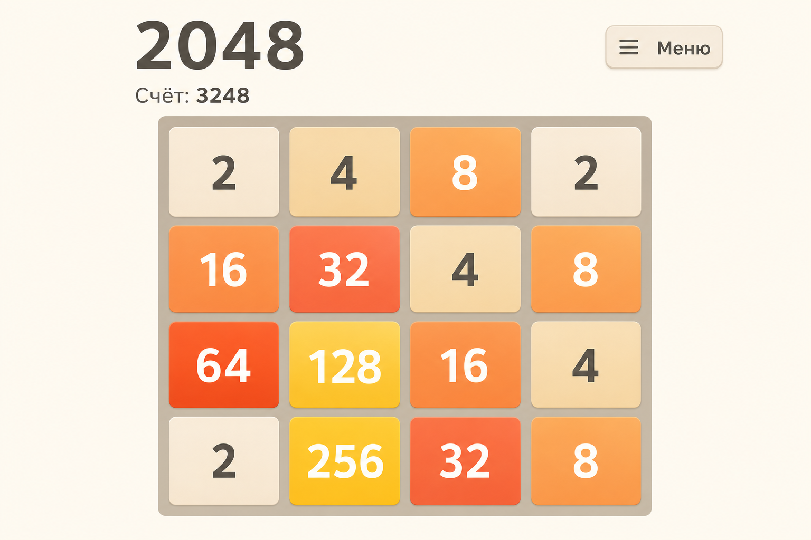
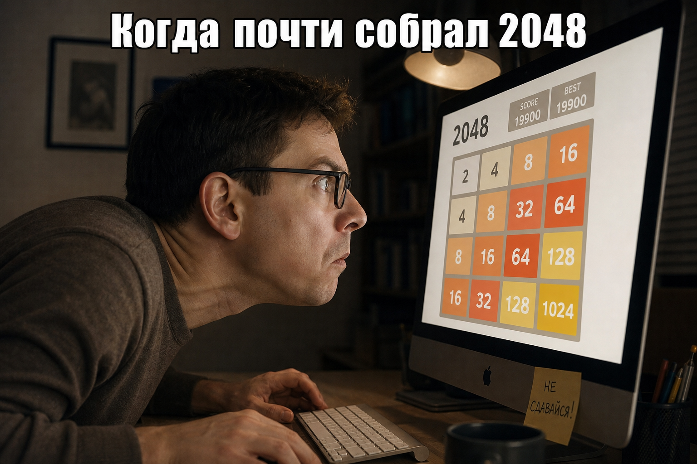
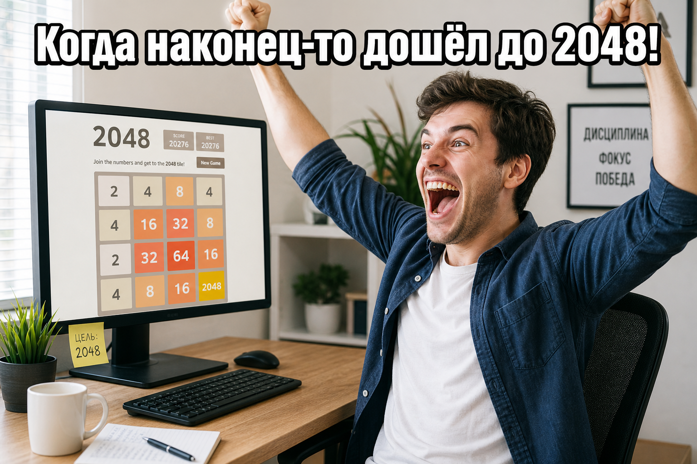

# 2048

<div align="center">



</div>

Реализация популярной головоломки 2048 на Python с использованием Pygame. Двигайте плитки с числами, объединяйте их и постарайтесь дойти до заветной плитки 2048!

## О проекте

Моя версия классической игры 2048. Сделала её, чтобы попрактиковаться в Python и разобраться с разработкой игр на Pygame. Игра полностью следует оригинальным правилам - используй стрелки, объединяй одинаковые числа и пытайся дойти до 2048 (а если получится, можно и дальше продолжить).

<div align="center">



*Обычная партия в 2048*

</div>

## Возможности

- ✨ Полностью на русском языке
- 🎮 Чистая MVC архитектура для удобства поддержки
- 🎯 Плавный геймплей на Pygame
- 📊 Отслеживание очков
- 💾 Сохранение и загрузка игры
- 🏆 Определение победы/поражения
- 🔄 Автосохранение при выходе
- 🚪 Кнопка быстрого выхода в меню

## Как запустить

### Требования

- Python 3.8 или выше
- Pygame 2.5.0+

### Установка

1. Клонируйте репозиторий:
```bash
git clone https://github.com/presenceofthemoon/2048.git
cd 2048
```

2. Установите зависимости:
```bash
pip install -r requirements.txt
```

### Как играть

Запустите игру:
```bash
python main.py
```

**Управление:**
- ⌨️ **Стрелки** - двигать плитки
- ⏸️ **ESC** - пауза
- 🔄 **R** - начать заново (когда игра окончена)
- 🚪 **Кнопка "Меню"** - выход в главное меню

**Правила:**
- Используй стрелки, чтобы двигать все плитки в одну сторону
- Когда две плитки с одинаковым числом соприкасаются, они объединяются
- После каждого хода появляется новая плитка (2 или 4) в случайном месте
- Игра заканчивается, когда нельзя сделать ход
- Достигни 2048, чтобы победить (но можно продолжать дальше и набирать больше очков!)

<div align="center">



*Когда наконец-то собрал 2048! 🎉*

</div>

## Структура проекта

```
2048/
├── models/              # Модели данных и бизнес-логика
│   ├── game.py          # Ядро игры: логика движения плиток, объединения, 
│   │                    # проверка победы/поражения, подсчет очков
│   └── tile.py          # Модель плитки с её значением и позицией
│
├── views/               # Слой представления (отрисовка)
│   ├── game_view.py     # Рендеринг игрового поля: плитки, сетка, анимация,
│   │                    # счет, сообщения о победе/поражении
│   └── menu_view.py     # Отрисовка меню и пользовательского интерфейса
│
├── controllers/         # Связующее звено между моделью и представлением
│   └── game_controller.py  # Обработка ввода игрока, управление игровым циклом,
│                           # координация между моделью и отображением
│
├── utils/               # Вспомогательные модули общего назначения
│   └── save_manager.py  # Сохранение и загрузка состояния игры в файл,
│                        # чтобы можно было продолжить позже
│
├── tests/               # Автоматизированное тестирование
│   └── test_game.py     # Юнит-тесты для проверки игровой логики
│
├── main.py              # Точка входа - запускает игру
└── requirements.txt     # Список зависимостей проекта
```

## Архитектура

Проект построен на паттерне **Model-View-Controller (MVC)** для разделения ответственности:

### Models (Модели)
Содержат всю игровую логику и состояние. Не знают ничего о том, как происходит отрисовка. Отвечают за:
- Правила игры (как плитки двигаются и объединяются)
- Состояние игрового поля
- Подсчет очков
- Определение конца игры

### Views (Представления)
Занимаются только отрисовкой. Берут данные из моделей и показывают их игроку через Pygame. Отвечают за:
- Визуализацию плиток и игрового поля
- Анимацию движения
- Отображение счета и сообщений
- Внешний вид интерфейса

### Controllers (Контроллеры)
Связывают модели и представления. Отвечают за:
- Обработку нажатий клавиш
- Запуск игрового цикла
- Координацию между логикой игры и её отображением
- Управление сохранением/загрузкой

Такая архитектура позволяет легко изменять одну часть (например, поменять графику), не трогая другие (игровую логику).

### Запуск тестов

```bash
python -m pytest tests/
```

